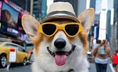
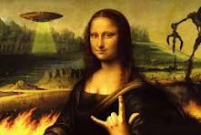
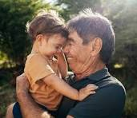

# azuremlimg

## Recohecimento de texto com IA
Projeto para fazer o reconehcimento de imagens foi interessante. Criar o recurso de IA e usar os processos existentes no portal foi fácil e intuitivo, sem problemas e muito divertido porque tem muitas opções legais. Na pasta inputs estão as imagens com texto que usei e na pasta output os arquivos texto com o o que a IA reconheceu. Realmente não tem milagres nem grandes surpresas, algumas coisas realmente são limites ainda mas no geral, o recomhecimento foi muito bom e bem rápido.

## Abaixo estão algumas images que subi para o serviço de ***análise de imagens*** e, abaixo de cada uma, a descrição feita pela IA.

### A dog wearing a hat and sunglasses

---

### A cartoon character in a kitchen

---

### A woman wearing goggles and a tower

---

### A painting of a woman with a hand gesture

---

### A man holding a child
---
